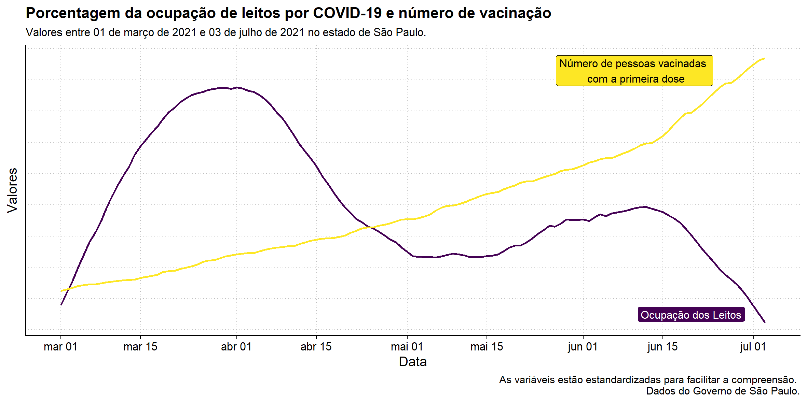
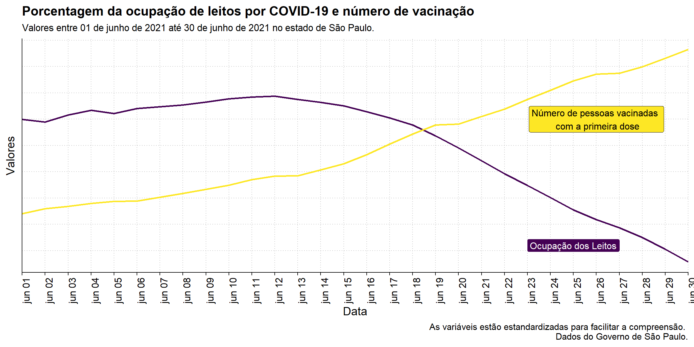

# vacinas.covid

<!-- badges: start -->
<!-- badges: end -->

O objetivo deste repositório foi analisar a relação entre o número de leitos ocupados por COVID-19 e o número de pessoas que receberam a primeira dose da vacina no estado de São Paulo. As análises foram conduzidas com os [dados do governo de São Paulo](https://www.saopaulo.sp.gov.br/planosp/simi/dados-abertos/) e de forma exploratória. Os resultados apresentados aqui são de caráter educacional.

## A vacina de COVID-19 funciona?

A grande questão relacionada as vacinas de COVID-19 é se elas funcionam ou não. Embora exista grande literatura sobre o tema, ainda assim há um seleto grupo que insiste em afirmar que vacinas não funcionam. Ainda mais, há uma outra população que crê que as vacinas de COVID-19 foram desenvolvidas de forma muito rápida e por conta disso, não são eficazes. Por outro lado, parte da população apresenta medos e dúvidas em relação a vacina de COVID-19 uma vez que há grande especulação em cima delas.

Mas ela funciona? Movido por essa questão, analisei os indicadores da pandemia no estado de São Paulo para apresentar o que está acontecendo. Relacionando os dados do número de pessoas vacinadas com a primeira dose e a porcentagem de ocupação de leitos por conta da COVID-19 foi possível encontrar alguns resultados. Dessa forma, conduzimos correlações, de Pearson e Bayesianas, para entender a relação entre as variáveis. A correlação de Pearson apontou para uma correlação inversamente proporcional e significativa. Já a correlação Bayesiana, demonstrou evidência decisiva para que a correlação seja negativa entre o número de pessoas vacinadas e a porcentagem de ocupação dos leitos por conta de COVID-19.

Embora os resultados sejam de caráter correlacional, podemos observar um padrão emergindo, e esse padrão é pautado por testes estatísticos. Dados dos próximos meses, enquanto a vacinação progride, poderão trazer ainda mais insights sobre o papel das vacinas em relação a ocupação dos leitos. Mas com os dados entre março e junho, é possível observar que enquanto mais pessoas recebiam a primeira dose, menor foi o número de leitos ocupados por conta de COVID-19.

